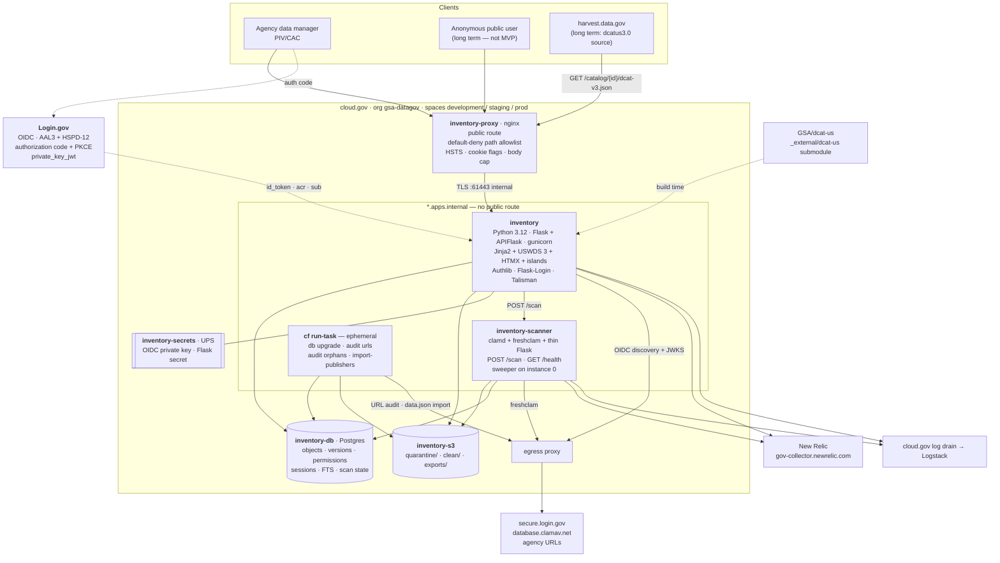
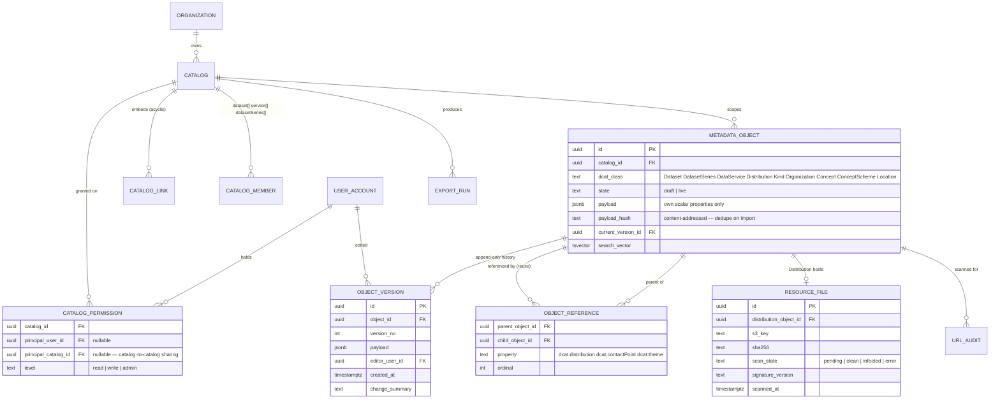
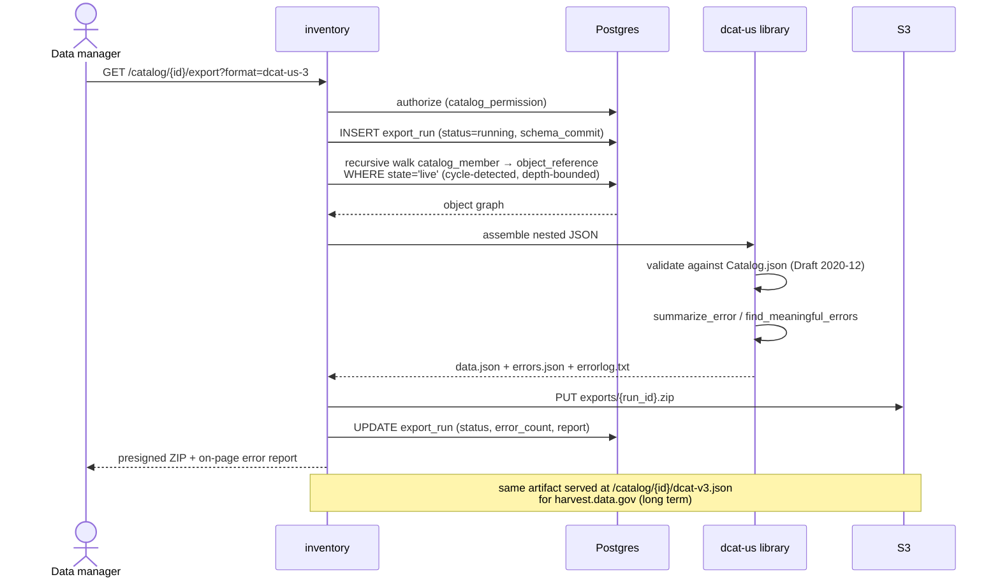
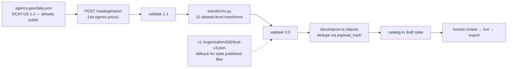
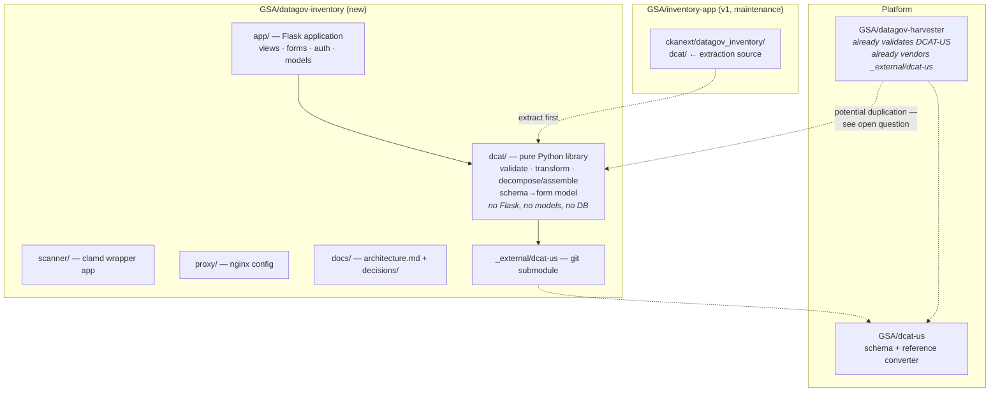

# inventory.data.gov v2 — System Architecture

> **Status: `draft`.** This document describes a *target* architecture, not a
> built system. Every significant choice here is backed by a decision record in
> [`docs/decisions/`](decisions/README.md), and **all eight of those records are
> `proposed`, not `accepted`** — seven carry explicit blockers that could change
> the design. See [Open blockers](#9-open-blockers). Nothing in this document
> describes the code currently in this repository, which is the CKAN-based v1.
>
> **This document is temporarily hosted in the v1 repository.** Per
> [ADR 0001](decisions/0001-repository-topology-for-inventory-v2.md), v2 is built
> in a new repository (`GSA/datagov-inventory`); these documents move there once
> it exists. All v1 code citations are pinned to
> [`GSA/inventory-app@9fc0003a`](https://github.com/GSA/inventory-app/tree/9fc0003a7f2aeac92bab852c7ad7e5418925de5c)
> (2026-09-04) so they remain accurate after the move.

## 1. Why v2 exists

The current application is a CKAN 2.11.5 monolith (a GSA fork pinned to a
`-nosolr` branch) with one custom extension and eight third-party or forked CKAN
extensions. The [v2 feature list](https://github.com/GSA/data.gov/wiki/Inventory-Beta-Re%E2%80%90design)
identifies the driving problem: *"the CKAN metadata model is not very compatible
with the nested object classifications of DCAT-US 3.0."*

Four v1 pain points set the scope:

| Pain point | v2 response |
|---|---|
| UI rewrite required for Section 508 compliance | Server-rendered USWDS with accessibility gates in CI ([ADR 0002](decisions/0002-ui-rendering-architecture-for-inventory-v2.md)) |
| Forked CKAN code will never merge upstream | No CKAN; one first-party application |
| Custom React form built for DCAT-US 1.1 needs a full rewrite for 3.0 | Form generated from the JSON Schema, so schema releases are a submodule bump |
| CKAN's flat model cannot express nested, reusable DCAT-US 3.0 classes | Object graph with reuse as edges ([ADR 0005](decisions/0005-object-graph-data-model-for-dcat-us-3.md)) |

### This is the platform's third CKAN exit, not a new direction

`catalog.data.gov` ([GSA/datagov-catalog](https://github.com/GSA/datagov-catalog))
and `harvest.data.gov` ([GSA/datagov-harvester](https://github.com/GSA/datagov-harvester))
both left CKAN in 2025 for **Python 3.12 / Flask / Postgres / cloud.gov / nginx
proxy / New Relic**. Inventory v2 is deliberately the third instance of that
pattern. Where this document departs from those two apps, it says so and why.

### The most important asset is already written

`ckanext/datagov_inventory/dcat/` contains the DCAT-US 1.1 → 3.0 conversion and
validation subsystem — `validator.py` (620 lines), `transforms.py` (469),
`dcat_converter.py` (281), `schema_paths.py` (24) — backed by ~1,600 lines of
tests. It is pure Python and touches CKAN at exactly one place
(`plugin.py:345-407`, the blueprint view).

**Extract it as a standalone library first.** It de-risks the rewrite more than
any other single action, and it is the foundation of both the export path and the
agency onboarding path.

## 2. Container view



### Why the two-app topology is retained

The CKAN app has **no public route** today; all public traffic traverses
`inventory-proxy`. That nginx config carries three security controls enforced
outside the application: default-deny path allowlisting
(`proxy/nginx.conf:44,48`), HSTS stamping with upstream-HSTS stripping (`:36,59`),
and cookie hardening (`:62`). Collapsing to one app would lose all three.

v2 keeps the topology **and** additionally implements header policy in
Flask-Talisman, so the policy is unit-testable rather than only observable in a
deployed environment.

## 3. Technology choices

| Layer | Technology | Rationale / departure from v1 |
|---|---|---|
| Runtime | Python 3.12 | v1 is pinned to 3.10 by CKAN. Matches catalog and harvester. |
| Framework | Flask + APIFlask | APIFlask yields OpenAPI for the import/export/validate API. Same as catalog. |
| Dependencies | Poetry | Replaces the `requirements.in.txt` → `bin/requirements.sh` → `requirements.txt` freeze cycle and the `jsonschema` post-install upgrade hack at `Dockerfile:28-29`. |
| UI | Jinja2 + USWDS 3 + HTMX, with scoped JS islands | [ADR 0002](decisions/0002-ui-rendering-architecture-for-inventory-v2.md). Islands: reference picker, `Location` geometry entry, catalog preview. |
| Form generation | Schema-driven renderer over `_external/dcat-us` | Field descriptions come from the schema, per the feature list. Schema releases become a submodule bump. |
| ORM | SQLAlchemy 2.0 + Alembic + psycopg 3 | v1 is on SQLAlchemy 1.4. |
| Database | Postgres (`medium-psql-redundant` prod, `small-psql` dev) | One instance. v1 has two plus Redis. |
| Search | Postgres FTS (`tsvector` + GIN) | **Deliberately not OpenSearch.** Catalog needs it at 515k datasets; Inventory holds thousands per org. |
| Cache / queue | none | Redis and RQ removed. Nothing in the MVP needs sub-minute async. |
| Auth | Login.gov OIDC via Authlib | [ADR 0003](decisions/0003-login-gov-oidc-instead-of-saml.md). Removes `pysaml2`, `xmlsec1`, and the `apt-buildpack`. |
| Session | Flask-Login + server-side sessions in Postgres, 900 s idle | Real revocation on logout. v1 also stores sessions in Postgres (`.profile:106`) but via Beaker. |
| Authorization | App-native per-catalog RBAC | [ADR 0004](decisions/0004-jit-user-provisioning-and-catalog-rbac.md). Replaces 15 chained CKAN auth functions, 2 rewritten ones, a regex path carve-out (`plugin.py:80-81`), and 2 `before_app_request` hooks. |
| Validation | jsonschema 4.x Draft 2020-12 + `referencing` | Reuse `validator.py` unchanged. |
| Schemas | `_external/dcat-us` git submodule + Dependabot | Already the pattern; keep it. |
| File storage | cloud.gov S3 + boto3, SHA-256, presigned downloads | |
| Malware scanning | ClamAV in a dedicated app, quarantine-then-scan | [ADR 0006](decisions/0006-quarantine-then-scan-antivirus.md). v1 has **no** scanning. |
| Background work | Flask CLI commands invoked by `cf run-task`, scheduled by GitHub Actions | Mirrors catalog's `flask sitemap generate`. Fixes v1's RQ worker co-located with gunicorn (`config/server_start.sh:9`), invisible to the health check. |
| Proxy | nginx via cloud.gov nginx-buildpack | Retained; see above. |
| Headers | Flask-Talisman + nginx | Testable in unit tests, enforced at the edge. |
| Observability | New Relic (gov-collector) + structured JSON logs with request and actor IDs | v1 logs are plain text with no correlation IDs, and nginx access logs omit client IP, timestamp, and latency (`proxy/nginx.conf:8-9`). |
| Tests | pytest, Playwright, pa11y-ci + axe, ruff/black/isort | Replaces Cypress 13; shares tooling with catalog. |
| CI/CD | GitHub Actions → `gsa/data.gov/.github/workflows/deploy-template.yml@main` | Same reusable templates. |

### Deliberate non-adoptions

- **OpenSearch** — wrong scale for Inventory; adds a service to operate.
- **Redis** — nothing left needs it once the DataStore and RQ are gone.
- **A client-side router / SPA** — see [ADR 0002](decisions/0002-ui-rendering-architecture-for-inventory-v2.md), including the conditions that would reverse that decision.
- **Client-side validation as authoritative** — a second validator would drift from `validator.py`. Any client-side check is advisory only.

## 4. Data model

The direct answer to the CKAN mismatch. Full reasoning and rejected alternatives
in [ADR 0005](decisions/0005-object-graph-data-model-for-dcat-us-3.md).



Three properties carry the requirements:

1. **`object_reference` is the reuse mechanism.** A `Kind` (contact point) or
   `Organization` (publisher) is one row referenced by many datasets. `payload`
   holds only that class's own scalar properties; nesting is edges. Export walks
   the graph and assembles nested JSON; import is the inverse.
2. **`payload_hash` is content-addressed.** Importing a flat catalog that repeats
   the same contact point 50 times converges on one shared object automatically —
   so "start from a current DCAT-US 3.0 catalog" and "classes defined for re-use"
   are one mechanism, not two features.
3. **`state` is per object.** "Drafts are not exported" becomes
   `WHERE state = 'live'` on the export walk. This replaces v1's documented
   three-way confusion between CKAN `private`, DCAT `accessLevel`, and Inventory
   publishing status ([GSA/data.gov#2095](https://github.com/GSA/data.gov/issues/2095)).

**Highest-risk surface:** graph assembly. Mitigations are non-optional —
property-based round-trip tests (`assemble ∘ decompose ≡ identity`), cycle
detection with a depth bound on the walk, an acyclicity check on `catalog_link`
writes, and schema validation of every export before delivery.

**Second risk:** reusable objects are addressable independently of the catalog a
user reached them through, so **every object route needs an explicit
direct-object-reference authorization check**. Object IDs are not authorization.

## 5. Key flows

### 5.1 Authentication and first-login provisioning

```mermaid
sequenceDiagram
    actor U as Data manager
    participant W as inventory
    participant L as Login.gov
    participant DB as Postgres

    U->>W: GET /login
    W->>W: generate state, nonce, PKCE verifier → session
    W-->>U: 302 → Login.gov (acr_values=AAL3+hspd12, PKCE S256)
    U->>L: PIV/CAC authentication
    L-->>U: 302 → /auth/callback?code&state
    U->>W: GET /auth/callback
    W->>W: verify state; bind PKCE verifier
    W->>L: token request (private_key_jwt + code_verifier)
    L-->>W: id_token
    W->>W: verify signature (JWKS), iss, aud, exp, nonce, acr
    Note over W: acr must assert AAL3+HSPD-12.<br/>Unchecked acr silently voids the IA-2 control.
    W->>DB: SELECT user_account WHERE login_gov_sub = sub
    alt first login
        W->>DB: INSERT user_account (sub, email) — ZERO catalog_permission rows
        W->>DB: audit: account_created
    end
    W->>DB: create server-side session
    W-->>U: 302 → workspace (empty unless permissions exist)
```

Account existence conveys **no** privilege; authorization is entirely
`catalog_permission`. See [ADR 0004](decisions/0004-jit-user-provisioning-and-catalog-rbac.md),
including the unresolved question of how the *first* `admin` grant on a new
catalog happens.

### 5.2 Export with error reporting



`export_run` records the `_external/dcat-us` submodule commit, so an export is
reproducible against the schema version that validated it.

### 5.3 Upload with quarantine-then-scan

```mermaid
sequenceDiagram
    actor U as Data manager
    participant W as inventory
    participant S3
    participant SC as inventory-scanner
    participant DB as Postgres

    U->>W: POST distribution file
    W->>W: size (≤500 MB) + MIME + extension allowlist
    W->>S3: stream → quarantine/{uuid}
    W->>DB: INSERT resource_file (scan_state=pending, sha256)
    W->>SC: POST /scan {s3_key, file_id} — fire-and-forget, 2 s timeout
    W-->>U: 202 — scanning, not yet downloadable
    Note over U,W: HTMX polls GET /file/{id}/status

    SC->>S3: stream object
    SC->>SC: clamd INSTREAM
    alt clean
        SC->>S3: copy → clean/{uuid}; delete quarantine/
        SC->>DB: scan_state=clean, scanned_at, signature_version
    else infected
        SC->>S3: delete object
        SC->>DB: scan_state=infected, threat_name
        SC->>W: notify org admin + Data.gov team (SI-3 / IR-6)
    end

    Note over SC,DB: sweeper, CF_INSTANCE_INDEX==0 only:<br/>pending >5 min → re-dispatch<br/>pending >60 min → scan_state=error + alert
```

Public download requires `scan_state='clean'`. Presigned URLs are minted only in
that state; `quarantine/` is never presigned; the bucket has no public-read
policy. "Unscanned" and "unreachable" are the same condition.

**The sweeper is why this works without a message broker** — dropped dispatches,
scanner restarts, and crashed scans all self-heal. It reuses the
`CF_INSTANCE_INDEX == 0` guard that harvester's `LoadManager` already uses.

### 5.4 Agency onboarding



There is **no CKAN migration path** ([ADR 0008](decisions/0008-onboard-via-data-json-reimport.md)).
The onboarding path and the migration path are the same code, so it is exercised
continuously rather than once at cutover. Imported catalogs are untrusted input:
fetched through the egress proxy, validated on both sides, and subject to the
live-catalog URL scanning the feature list requires.

## 6. Deployment

Per-environment sizing follows v1 (`vars.*.yml`), minus the removed services.

| | development | staging | prod |
|---|---|---|---|
| `inventory` instances | 1 | 2 | 2 |
| Route (public) | `inventory-dev-datagov.app.cloud.gov` | `inventory-stage-datagov.app.cloud.gov` | `inventory.data.gov` |
| Postgres plan | `small-psql` | `medium-psql-redundant` | `medium-psql-redundant` |
| New Relic monitoring | off | on | on |

**Services bound:** `inventory-db`, `inventory-s3`, `inventory-secrets`.
Removed relative to v1: `inventory-datastore`, `inventory-redis`,
`sysadmin-users`.

### Deployment differences from v1 that matter

- **Migrations run once, via `cf run-task`, before the app rolls.** v1 runs
  `ckan db upgrade` in `.profile:151` on *every instance at every boot* with
  `instances: 2` — a concurrency hazard.
- **One buildpack per app.** Removing SAML removes `xmlsec1`, which is the only
  reason `apt-buildpack` precedes `python_buildpack` in `manifest.yml:6-8`.
- **No 15-minute restart cron.** `.github/workflows/restart.yml` currently
  rolling-restarts prod and staging every 15 minutes. **Eliminating this is a v2
  acceptance criterion**, not an aspiration — it is the loudest operational
  signal in the v1 repository.
- **Background work is a task, not a thread.** Scheduled `cf run-task`
  invocations of Flask CLI commands, replacing the RQ worker co-located with
  gunicorn.

### Scheduled tasks

| Task | Cadence | Purpose |
|---|---|---|
| `flask audit urls` | daily | Scan `live` catalog URLs for malicious content (feature-list requirement) |
| `flask audit orphans` | daily | Catalogs with no `admin` — one query over `catalog_permission` |
| `flask db upgrade` | per deploy | Once, before rollout |
| `flask import-publishers` | on CSV change | Carries forward v1's `update_publishers.yml` |
| freshclam | per scanner schedule | Signature updates; **alert on signature age**, not only on scan failure |

### Egress allowlist

Three outbound destinations, all through the cloud.gov egress proxy:
`secure.login.gov` (OIDC discovery and JWKS), `database.clamav.net` (signatures),
and agency URLs (`data.json` import and URL auditing). All three fail closed.
OIDC discovery and JWKS documents must be cached with a bounded TTL so a
transient Login.gov outage does not deny all logins.

## 7. What v1 components disappear

| Removed | Notes |
|---|---|
| CKAN 2.11.5 (GSA fork, pinned commit) | Plus 8 extensions, 3 of them GSA/vendor forks |
| Solr scaffolding | Already dead in v1: 12 files, 3 Makefile targets, a `pysolr` pin, a placeholder `CKAN_SOLR_URL`, a `/solr` nginx route |
| Redis + RQ | No remaining need |
| DataStore + xloader + `datastore_ro` provisioning | [ADR 0007](decisions/0007-retire-tabular-datastore-api.md) — **a user-visible regression**, see below |
| `pysaml2`, `xmlsec1`, `apt.yml`, `apt-buildpack` | [ADR 0003](decisions/0003-login-gov-oidc-instead-of-saml.md) |
| repoze.who + Beaker | Vestigial since CKAN 2.9 |
| `create_inventory_user`, `reactivate_user`, roles-table admin UI | ~278 lines of `plugin.py`, 152 of `action.py`, 115-line template ([ADR 0004](decisions/0004-jit-user-provisioning-and-catalog-rbac.md)) |
| `Jenkinsfile`, `bin/jenkins_build` | Dead: gated on a branch that no longer exists |
| `restart.yml` 15-minute cron | Acceptance criterion |

**The DataStore removal is a real capability loss, not only cleanup.** Uploaded
files remain downloadable; what goes away is querying their rows over HTTP.
[ADR 0007](decisions/0007-retire-tabular-datastore-api.md) requires identifying
live consumers of `/api/action/datastore_search` before this is announced.

## 8. Code organization

Per [ADR 0001](decisions/0001-repository-topology-for-inventory-v2.md), v2 is
built in a **new repository, `GSA/datagov-inventory`**, following the pattern of
`datagov-catalog` and `datagov-harvester`. v1 remains in `GSA/inventory-app` and
stays in production until every agency has completed re-import
([ADR 0008](decisions/0008-onboard-via-data-json-reimport.md)) — the two
codebases run and are patched concurrently for months.



### Extract the DCAT library first

`ckanext/datagov_inventory/dcat/` — `validator.py` (620 lines), `transforms.py`
(469), `dcat_converter.py` (281), `schema_paths.py` (24), plus ~1,600 lines of
tests — is pure Python and touches CKAN at exactly one place
(`plugin.py:345-407`, the blueprint view). It is the foundation of both the export
path (§5.2) and agency onboarding (§5.4).

The library boundary is a hard rule: **no Flask, no Inventory models, no database
access.** Its only inputs are JSON documents and schema paths. This is what makes
it callable from the web app, from `cf run-task` commands, from a CLI, and — if
promoted to a shared repository later — from another application.

### Open question: one DCAT library or two?

`datagov-harvester` **already validates DCAT-US against JSON Schema** in its
VALIDATE pipeline stage, already vendors `_external/dcat-us` as a submodule, and
already serves the public validator at `harvest.data.gov/validate/`. If Inventory
extracts its own validation library and the harvester keeps its own, the platform
will have two Python implementations of DCAT-US validation drifting apart — and
that drift surfaces to agency publishers as inconsistent results between the
harvester's public validator and Inventory's export report.

Three options — a package inside `datagov-inventory`, a third shared repository,
or contributing upstream to `GSA/dcat-us` — are laid out in
[ADR 0001](decisions/0001-repository-topology-for-inventory-v2.md#open-question-where-does-the-shared-dcat-us-library-live).
The recommendation is to start with the in-repo package while designing the
boundary as if it were shared, so promotion is a move rather than a rewrite.
**This needs the harvester team's input before extraction begins**, since
extraction is on v2's critical path.

## 9. Open blockers

No record should be accepted — and no build should start on the affected
area — until these clear. Reproduced from
[`docs/decisions/README.md`](decisions/README.md).

| ADR | Blocker | Type |
|---|---|---|
| 0001 | Request `GSA/datagov-inventory` per the new-repository checklist; decide where the shared DCAT-US library lives (needs harvester team input). | Organizational + design |
| 0002 | Confirm the editing model: **(A)** decomposed per-object screens vs. **(B)** unified tree-plus-detail workspace. (B) reverses the decision toward an SPA. | Product |
| 0003 | Login.gov must confirm OIDC registration with `acr_values` AAL3+HSPD-12 per environment; verify the returned `acr` claim in the sandbox. If unavailable, fall back to SAML. | External |
| 0004 | Confirm whether an email-domain allowlist is wanted; define how the first `admin` grant on a new catalog happens. | Product + design |
| 0006 | Query existing S3 objects for actual file-size distribution to confirm 500 MB. | Data |
| 0007 | Query access logs and New Relic for `datastore_search` consumers (required CM-4 impact analysis). | Data |
| 0008 | Records-officer determination on NARA retention of v1 edit history; archive the v1 database if required. | Compliance |

**Longest lead time: ADR 0003.** The Login.gov OIDC confirmation is the only
blocker with an external dependency, spans three environments, and reverses a
decision that ADR 0004 builds on. Start it first; every other blocker is
answerable internally within days.

## 10. Compliance posture

Control mappings live in the individual decision records. Summary of what
changes relative to v1:

- **Strengthened:** SI-3 (malware scanning, previously absent), AU-2/AU-3/AU-10
  (append-only version history with editor attribution; structured logs with
  correlation IDs), AC-6 (default privilege is exactly none), CM-7 (DataStore
  and Solr surfaces removed).
- **Preserved:** IA-2 AAL3 + HSPD-12 (PIV/CAC) — *pending sandbox verification*;
  AC-12 900-second idle timeout, now with autosave so the timeout costs no work;
  SC-7 boundary protection via the two-app topology.
- **Changed and requiring SSP updates:** AC-2 (accounts created automatically,
  with zero-privilege as the compensating control — an assessor must see both
  statements together), and the data-flow and component inventory for the two
  `yes-boundary` decisions (ADR 0006 adds a scanner and an outbound flow;
  ADR 0007 removes a brokered data store and a public API).
- **Requires a decision not yet made:** SI-12 retention policy for
  `object_version`, which grows without bound by design.

## 11. References

- [Inventory Beta Re-design](https://github.com/GSA/data.gov/wiki/Inventory-Beta-Re%E2%80%90design) — the v2 feature list
- [Decision records index](decisions/README.md) — ADRs 0002–0007
- [DCAT-US 3.0](https://github.com/GSA/data.gov/wiki/DCAT-US-3.0) · [1.1 vs 3.0](https://github.com/GSA/data.gov/wiki/DCAT-US-1.1-vs-3.0) · [GSA/dcat-us](https://github.com/GSA/dcat-us)
- [GSA/datagov-catalog](https://github.com/GSA/datagov-catalog) · [catalog.data.gov wiki](https://github.com/GSA/data.gov/wiki/catalog.data.gov) — the pattern being followed
- [GSA/datagov-harvester](https://github.com/GSA/datagov-harvester) · [harvest.data.gov wiki](https://github.com/GSA/data.gov/wiki/harvest.data.gov) — `LoadManager` sweeper precedent
- [inventory.data.gov wiki](https://github.com/GSA/data.gov/wiki/inventory.data.gov) — current-state operations
- [data.gov SYSTEMS.md](https://github.com/GSA/data.gov/blob/main/SYSTEMS.md) — platform systems list
